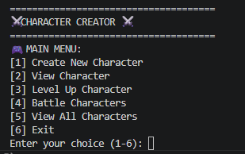

# ⚔️ Video Game Character Creator
***



A simple text‑based RPG character creator and battle simulator built in Python.  
Players can create characters, level them up, view stats, and run turn‑based battles.  
This project demonstrates object‑oriented programming concepts such as classes, methods, attributes, and interactions between objects.

---

## 🚀 How to Use
***

1. Open the project folder in VS Code or your preferred editor.
2. Ensure the following files are inside the same directory:
   - `main.py`
   - `game.py`
   - `character.py`
3. Run the program using:
   ```
   python3 main.py
   ```
4. Use the on‑screen menu to:
   - Create characters  
   - View character stats  
   - Level up characters  
   - Battle characters  
   - View all characters  
5. No external libraries are required — everything uses built‑in Python.

---

## 🧩 Project Features
***

### 🧍 Character System
- Three character classes:
  - **Warrior** — High HP & Defense  
  - **Mage** — High Attack, Low HP  
  - **Archer** — Balanced stats  
- Tracks:
  - Name  
  - Class  
  - Level  
  - HP / Max HP  
  - Attack  
  - Defense  
  - Alive/Knocked Out status  

### 📈 Leveling System
- Leveling up increases:
  - Max HP  
  - Attack  
  - Defense  
- HP fully restores on level‑up

### ⚔️ Battle System
- Turn‑based combat  
- Characters alternate attacking  
- Damage formula:
  ```
  damage = attack - defense
  ```
- Characters are knocked out at 0 HP  
- Winner is announced at the end  

### 🖥️ Text‑Based Menu
- Clean, simple UI  
- Options for creating, viewing, leveling, battling, and listing characters  

---

## 🛠️ Installation Instructions
***

This project runs directly in Python — no installers or executables needed.  
If you later package it into an `.exe`, setup instructions would go here.

---

## 📜 Licence
***

Anything made for school has no copyright.

---

## 👥 Contributors
***

- DigitalRage (GitHub username)  
- Add any teammates here if needed

---

## 🤝 Contribute
***

Not used for this class.  
If this were an open‑source project, this section would explain how to submit pull requests or issues.
